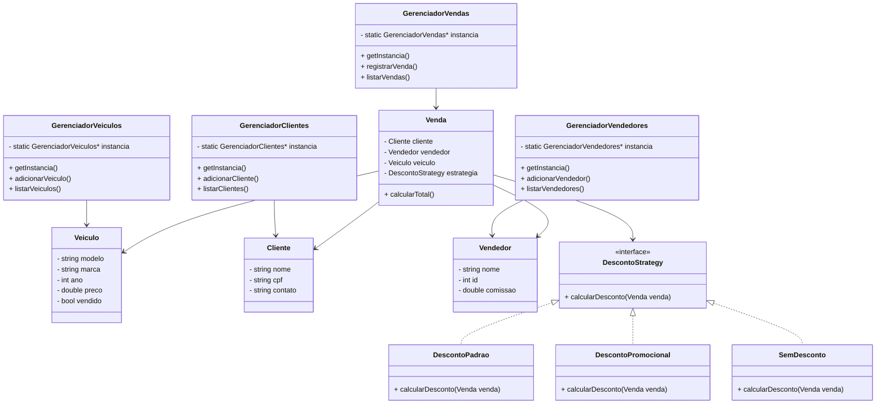

# 🚗 DriveTech

Sistema de gerenciamento de concessionária desenvolvido em **C++** utilizando o **framework Qt (versão 6.4.2)**.  
O projeto foi criado como parte das atividades acadêmicas da disciplina de Programação Orientada a Objetos, com o objetivo de aplicar conceitos de modularização, encapsulamento e persistência de dados.

---

## 🧠 Sobre o Projeto

O **DriveTech** é um sistema que busca simplificar o gerenciamento de uma concessionária, permitindo o **cadastro de compradores**, o **registro de vendas**, além de oferecer funcionalidades para **listar o estoque de veículos** e **consultar o histórico de vendas realizadas**.

O sistema foi projetado com foco em uma interface intuitiva e na aplicação prática de princípios de **POO (Programação Orientada a Objetos)**, utilizando os recursos do **Qt** para o desenvolvimento da interface gráfica e manipulação de dados.

---

## ⚙️ Funcionalidades

- 📋 Cadastro de compradores  
- 🚘 Cadastro e listagem de veículos em estoque  
- 💰 Registro de vendas  
- 📈 Consulta de histórico de vendas  
- 💾 Salvamento e carregamento de dados em arquivos  

---

## 🧩 Tecnologias Utilizadas

- **Linguagem:** C++  
- **Framework:** Qt 6.4.2  
- **Paradigma:** Programação Orientada a Objetos  
- **IDE:** Qt Creator  

---

## 🖥️ Como Executar o Projeto

1. **Clone o repositório**
   
   ```bash
   git clone https://github.com/seuusuario/drivetech.git
   ```
   
2. **Abra o projeto**

   - No Qt Creator, selecione “Open Project” e abra o arquivo CMakeLists.txt.
   
4. **Configure o kit de compilação**

   - Utilize a versão do Qt 6.4.2 (ou superior compatível).
   
5. **Compile e execute**

    - Clique em Build → Run dentro do Qt Creator.
---
## 🧱 Estrutura de Classes e Padrões de Projeto

O sistema **DriveTech** foi desenvolvido com base nos princípios da **Programação Orientada a Objetos (POO)**, aplicando conceitos como **encapsulamento**, **modularização** e **reutilização de código**.  
Além disso, foram utilizados **padrões de projeto (Design Patterns)** para garantir um código mais organizado, flexível e de fácil manutenção.

---

### 🧩 Classes Principais

- **`Veiculo`**  
  Representa os veículos disponíveis na concessionária, armazenando informações como modelo, marca, ano, valor e status (disponível ou vendido).  
  Essa classe serve de base para o gerenciamento de estoque e para o registro das vendas.

- **`Cliente`**  
  Armazena os dados dos compradores, incluindo nome, CPF e informações de contato.  
  É utilizada tanto no cadastro de novos clientes quanto na associação com as vendas realizadas.

- **`Vendedor`**  
  Representa os funcionários responsáveis pelas vendas.  
  Cada vendedor possui informações como nome, ID e comissão, e está vinculado às transações registradas no sistema.

- **`Venda`**  
  Registra as transações realizadas entre clientes e vendedores, vinculando os veículos vendidos e aplicando possíveis estratégias de desconto.  
  É a classe central do processo comercial dentro do sistema.

---

### 🧠 Gerenciadores (Singleton)

Cada entidade principal do sistema — **Veículos**, **Clientes**, **Vendedores** e **Vendas** — possui uma classe gerenciadora dedicada ao controle das suas instâncias.  
Esses gerenciadores seguem o **padrão de projeto Singleton**, garantindo que exista **apenas uma instância global** de cada um durante toda a execução do programa.

**Gerenciadores Singleton:**
- `GerenciadorVeiculos`
- `GerenciadorClientes`
- `GerenciadorVendedores`
- `GerenciadorVendas`

**Responsabilidades:**
- Centralizar o acesso e a manipulação dos dados.  
- Garantir a integridade das informações entre diferentes partes do sistema.  
- Facilitar a persistência e o carregamento dos registros em arquivos.  

O uso de Singletons evita inconsistências e simplifica o gerenciamento das entidades, já que todos os módulos interagem com uma única instância compartilhada.

---

### 🎯 Estratégia de Descontos (Strategy)

Dentro da classe `Venda`, foi implementado o **padrão Strategy** para gerenciar as diferentes formas de aplicação de descontos.  
Essa abordagem permite alterar a lógica de cálculo de desconto **sem modificar a estrutura da classe principal**, tornando o código mais flexível e aderente ao princípio do **Open/Closed** (aberto para extensão, fechado para modificação).

**Estrutura do Strategy:**
- Interface base: `DescontoStrategy`  
  - Define o método `calcularDesconto(Venda venda)`.

- Implementações concretas:
  - `DescontoPadrao` — aplica um desconto fixo ou percentual comum.  
  - `DescontoPromocional` — usado em períodos específicos ou campanhas.  
  - `SemDesconto` — opção padrão quando nenhuma promoção está ativa.

Essa arquitetura permite que novas estratégias de desconto sejam adicionadas facilmente, sem alterar o restante do código.

---

### 🧭 Diagrama de Classes (UML)


---
## 👨‍💻 Desenvolvido por

 - Eduardo Haag

 - Gabriel Bonfim
  
 - Projeto acadêmico desenvolvido para fins de aprendizado e aplicação prática dos conceitos de Programação Orientada a Objetos.

## 🏁 Conclusão

O **DriveTech** representa a integração entre teoria e prática no desenvolvimento de sistemas orientados a objetos, demonstrando o uso do Qt como ferramenta poderosa para construção de interfaces gráficas modernas em C++.
